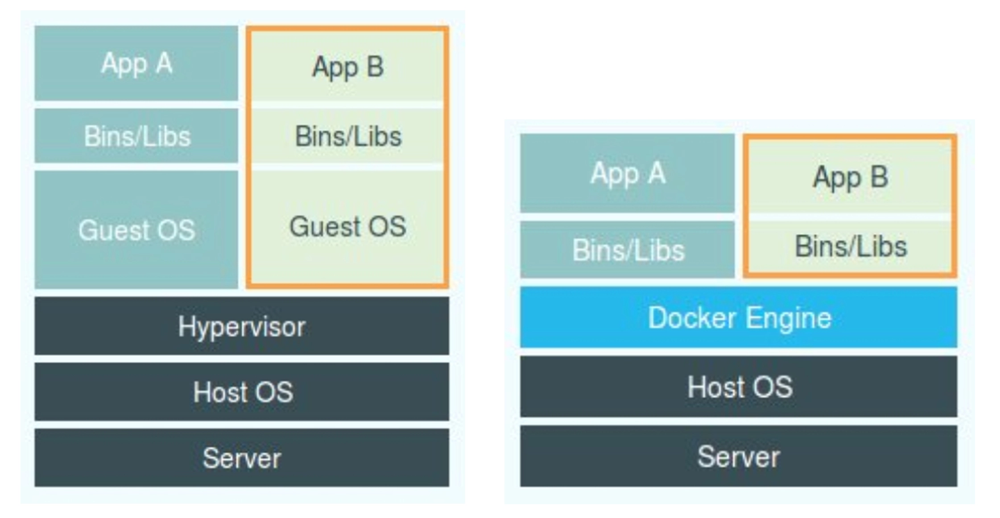

# 《深入剖析kubernetes》笔记

## 容器的发展

> **PaaS初期阶段**

PaaS：平台即服务 (PaaS) 是云中的完整开发和部署环境。

一开始它的主流用法就是租用一批虚拟机，然后将虚拟机的环境管理得像物理机一样，再去部署应用。类似九毛九买得超融合，在里面搭建n个虚拟机构成私有云一样

所以此时的核心是  **应用的打包和分发机制** ， 这等同于将 **应用的可执行文件 和 启动脚本** 打进一个 压缩包 ，上传到云上 Cloud Foundry 的存储中。Cloud Foundry 通过调度器选择一个虚拟机，然后通知这个虚拟机上的 Agent 把应用压缩包下载下来启动

> **PaaS初期的容器**

所以“容器”就是运行应用的 隔离环境 。这个容器（或者说这个隔离环境）是通过 **Cgroups 和 Namespace** 机制为每一个应用单独创建的。

&nbsp;
### 1. **容器隔离的namespace机制**

容器本身是一个**单进程**模型

linux利用clone创建新进程时，指定 CLONE_NEWPID 参数，就令进程的id与**系统**还有**其他namespace**的进程id隔离了。具体隔离的信息包括：**进程号，挂载点信息，网络设备，配置**等

&nbsp;

### 2. **容器资源限制的Cgroups机制**

Cgroups限制一个**进程组**能够使用的资源上限，包括 CPU、内存、磁盘、网络带宽等等

**容器和应用能够同生命周期**，这个非常重要。否则，一旦出现类似于“容器是正常运行的，但是里面的应用早已经挂了”的情况，编排系统处理起来就非常麻烦了。

>可怜的容器，**被Namespace欺骗，又被Cgroups限制**，在这样的环境下，还发挥着自己生命的意义-**与应用程序同生命周期，同生共死**

---  
&nbsp;

> **Docker阶段**

而Docker大部分都是和Cloud Foundry是一样的，最大的区别就是——**docker镜像**。

docker镜像除了将 **应用的可执行文件 和 启动脚本** 打进一个 压缩包。还把 **系统的文件和目录** 打进去压缩包里。保证了容器的环境与你开发和测试的环境是一致的

docker利用`docker build image-name`来构建镜像，将 应用的可执行文件 和 启动脚本 还有 系统的文件和目录 一并构建成一个可运行的镜像

然后在云上环境利用`docker run image-name`就可以一键部署镜像，从而运行里面的应用了。中间的系统文件目录 还有 **应用所需的依赖** 不再需要手动配置，因为构建镜像的时候就已经打包好了

这就是“容器化”取代“PaaS化”的重要原因

&nbsp;

> **Docker时期的容器**

除了 **应用的可执行文件 , 启动脚本** , **系统的文件和目录** 还有 **应用所需的依赖**

对于**进程**来说，它的静态表现就是程序，平常都安安静静地待在磁盘上；而一旦运行起来，它就变成了计算机里的数据和状态的总和，这就是它的动态表现。

**容器技术的核心功能，就是通过约束和修改进程的动态表现，从而为其创造出一个“边界”**。

下图就体现了容器的轻量化，不用像虚拟机那样要配置虚拟操作系统等“等量信息”，这也是容器运行数量可以比虚拟机多得多的原因

&nbsp;

## 容器编排项目

> **Kubernetes**

